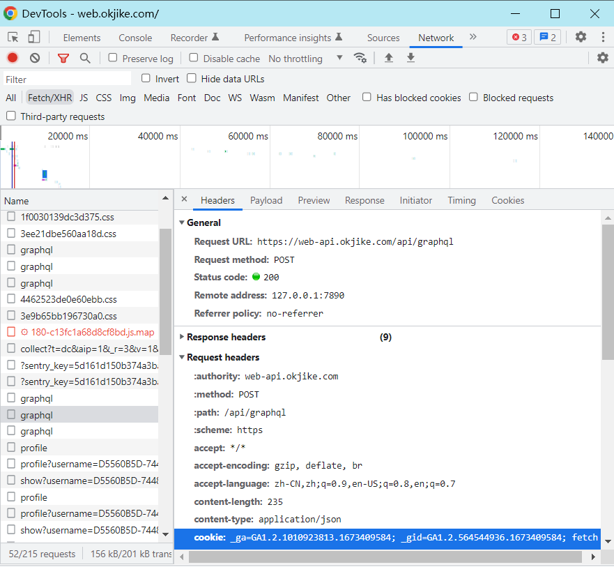

# Jike-crawl

## Jike-crawl (EN)

Crawl all Posts, Notifications, and maybe Collections(undone) on Jike and save them in `csv file`(undone) / `json file` / `MySQL`(undone) before you delete your Jike account.

Count and analysis(undone) infomations and posts.

Maybe using NLP for sentiment analysis(undone).


Haven't implement something like crawl posts posted more than 1 month ago. If you want to do so, please try to learn GraphQL and modified the query or find some code in `data_analysis.py` may helps.

### Requirements

Python 3
json
requests

### Run

Login to [Jike](https://web.okjike.com/), press `F12` to open DevTools. Switch to `Network` tab, filter `Fetch/XHR`, refresh the page, then there will be some requests on it. Select one `graphql` request and copy value of `cookie` from `Request headers` into `cookies.txt` file.



Then run.

```shell
python -u [python_file_path]
```

#### Crawl

Choose operations in the `main()` of `src/crawl.py` and run.

#### Analysis

Run `src/data_analysis.py`.

You can also modified code in that file to get statistics you like.

## 删号跑路（中文）

在注销即刻账号跑路之前保存自己的动态和消息。

统计并生成报告。


### 运行

登录 [即刻网页版](https://web.okjike.com/)， 按 `F12` 打开开发者工具。切换到 `网络`，过滤 `Fetch/XHR`，刷新页面，这时网络上会出现一些请求。随便选一个 `graphql` 请求，在请求标头里找到 `cookie` 字段，复制值到 `cookies.txt` 文件。


然后就可以跑了。

```shell
python -u [python_file_path]
```

#### 保存数据

在 `src/crawl.py` 的 `main()` 函数中调用所需操作然后运行。

#### 数据分析

运行 `src/data_analysis.py`。

您可以修改该文件得到自己想要的统计，如获取评论您最多的用户等。

## Appendices

### query

`web.okjike.com` uses [GraphQL](https://graphql.cn/learn/queries/) for query.

In folder `query`, there're two types of text files. One with suffix `_original` means that query is used by `web.okjike.com` originally and with too much useless content and avatar urls. Others are used in this project to get useful content.

#### query infomations

payload

```json
{
    "operationName": "ListNotification",
    "query": "query/query_notifications_original.txt",
    "variables": {}
}
```

returns

`"loadMoreKey"` returns `"lastNotificationId"` which can be used to load more.

`"nodes"` contains an array of notifications.

`"id"` maybe the unique key of notifications.

`"referenceItem"` what this notification references to, maybe your post or your comment. If it references to a comment, then `"targetId"` will be the original post id (or see `"targetType"` which will be `"ORIGINAL_POST"`).

`"type"`:

- `"LIKE_PERSONAL_UPDATE"` a user liked your post.
- `"COMMENT_PERSONAL_UPDATE"` a user commented on your post.
- `"LIKE_PERSONAL_UPDATE_COMMENT"` a user liked your comment.
- `"REPLIED_TO_PERSONAL_UPDATE_COMMENT"` a user replied to your comment. Picture will not be shown.
- `"AVATAR_GREET"`
- `"USER_FOLLOWED"` a user followed you
- `"USER_SILENT_FOLLOWED"` a user without `linkUrl` followed you
- `"CURIOSITY_REPLIED_MY_MENTIONING"` on web page, unlike app, it will not show any content.
- `"CURIOSITY_ANSWER_REACTION"` reacted to my answer.
- `"CURIOSITY_MENTION_ME_ANSWER"` asked me to answer.

If `"actionType": "USER_LIST"` then `"actionItem"` will be a list of users liked this post or comment.

If `"actionType": "COMMENT"` then `"actionItem"` will be a comment, also with a user in `users` list.

#### query user feeds

payload

```json
{
    "operationName": "UserFeeds",
    "query": "query/query_user_feeds_original.txt",
    "variables": {
        "username": "D5560B5D-7448-4E1A-B43A-EC2D2C9AB7EC",
        "loadMoreKey": {
            "lastId": "63a450102559c538e1bd3482"
        }
    }
}
```

#### query message detail

payload

```json
{
    "operationName": "MessageDetail"
    "query": "query/query_message_detail_original.txt",
    "variables": {
        "messageType": "ORIGINAL_POST",
        "messageId": "63a3b8b160f43c294d672622"
    }
}
```

#### query message comments

payload

```json
{
    "operationName": "MessageComments",
    "query": "query/query_message_comments_original.txt",
    "variables": {
        "messageId": "6389d93582742179e6a9335c",
        "messageType": "ORIGINAL_POST"
    }
}
```

#### remove message

payload

```json
{
    "operationName": "RemoveMessage",
    "variables": {
        "messageType": "ORIGINAL_POST",
        "id": "63872d0c02237e4e5813435d"
    },
    "query": "mutation RemoveMessage($id: ID!, $messageType: MessageType!) {\n  removeMessage(messageType: $messageType, id: $id) {\n    toast\n    __typename\n  }\n}\n"
}
```
